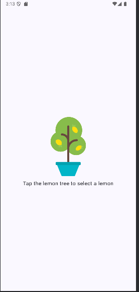
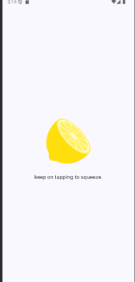
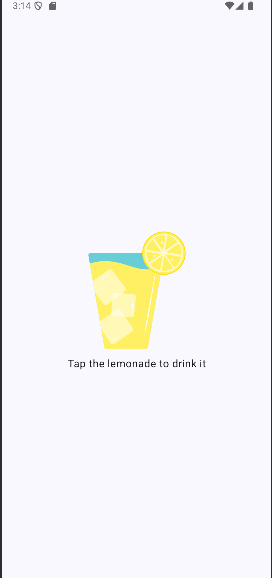
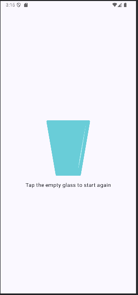

# Lemonade Tap App

A fun and interactive Android app built with Jetpack Compose where you tap through the steps of making lemonade: picking a lemon, squeezing it, drinking it, and restarting.

## Features

- Tap the lemon tree to pick a lemon.
- Tap the lemon multiple times to squeeze it (random taps required each time).
- Tap the lemonade glass to drink.
- Tap the empty glass to restart the process.

Each cycle randomizes the number of squeezes needed.

## How It Works

1. Tap the Lemon Tree to select a lemon 🍋  
   

2. Squeeze the lemon by tapping✋  
   

3. Drink the lemonade by tapping it🥤  
   

4. Empty glass – start again 🔁  
   

## Technologies Used

- Kotlin
- Android Jetpack Compose
- Material3 design components

## Getting Started

1. Clone the repository:
   ```bash
   git clone https://github.com/Sekomane/LemonadeTapApp.git
   ```
2. Open the project in Android Studio.
3. Build and run the app on an emulator or physical Android device.
